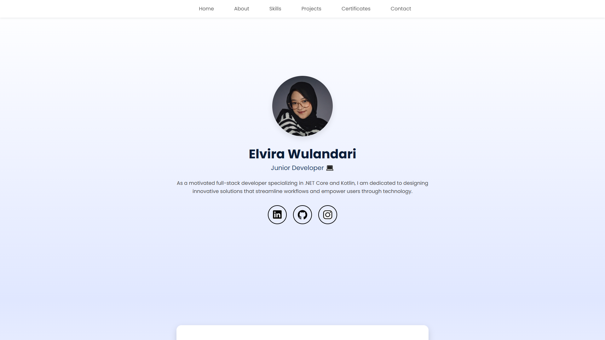

# 🌐 Elvira's Portfolio

Welcome to my personal portfolio website!  
This project showcases my journey as a junior developer, highlighting my **skills, projects, certifications, and experiences** in software development.

## ✨ About Me
Hi there! I'm **Elvira**, a junior developer with hands-on experience in **.NET Core** and **Kotlin**.  
I enjoy building scalable, user-friendly applications and turning complex ideas into practical solutions that create impact.

🌱 I’m continuously learning and exploring new technologies to sharpen my craft and stay adaptable.

## 🛠️ Tech Stack
This portfolio is built with:
- **HTML5, CSS3, JavaScript**
- **Bootstrap 5** for responsive design
- **Custom CSS** for styling

## 📂 Sections
- **About Me** – A quick introduction  
- **Skills** – Tools & technologies I work with  
- **Projects** – Featured works & case studies  
- **Certificates** – Recognitions & achievements  
- **Contact** – Let's connect!  

## 📬 Contact
If you’re interested in collaborating or just want to say hi, feel free to reach out:  

- 🌐 [Portfolio Website](https://elvirawlndr.github.io/portfolio)  
- 💼 [LinkedIn](https://www.linkedin.com/in/elvirawlndr)  
- 📧 Email: ewulandari2804@email.com  
